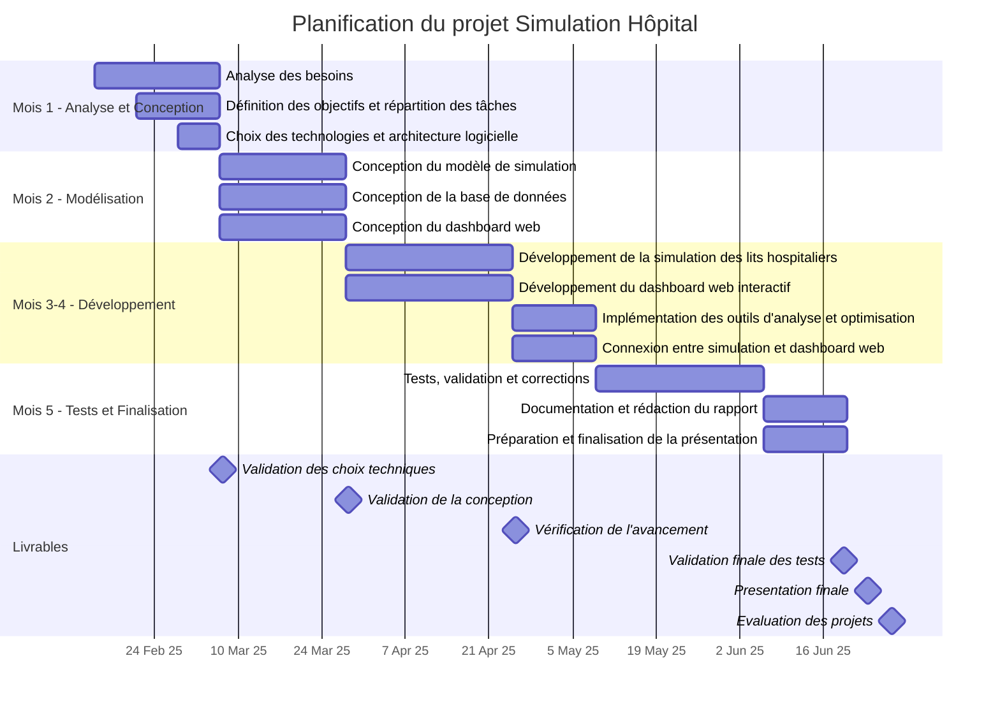

```mermaid    
    gantt
    title Planification du projet Simulation Hôpital
    dateFormat DD/MM/YYYY
    axisFormat %e %b %y
    tickInterval 2week
    weekday monday
    todayMarker on

    section Mois 1 - Analyse et Conception
    Analyse des besoins: 14/02/2025, 3w
    Définition des objectifs et répartition des tâches: 21/02/2025, 2w
    Choix des technologies et architecture logicielle: 28/02/2025, 1w

    section Mois 2 - Modélisation
    Conception du modèle de simulation: 07/03/2025, 3w
    Conception de la base de données: 07/03/2025, 3w
    Conception du dashboard web: 07/03/2025, 3w

    section Mois 3-4 - Développement
    Développement de la simulation des lits hospitaliers: 28/03/2025, 4w
    Développement du dashboard web interactif: 28/03/2025, 4w
    Implémentation des outils d'analyse et optimisation: 25/04/2025, 2w
    Connexion entre simulation et dashboard web: 25/04/2025, 2w

    section Mois 5 - Tests et Finalisation
    Tests, validation et corrections: 09/05/2025, 4w
    Documentation et rédaction du rapport: 06/06/2025, 2w
    Préparation et finalisation de la présentation: 06/06/2025, 2w

    section Livrables
    Validation des choix techniques: milestone, 07/03/2025, 1d
    Validation de la conception: milestone, 28/03/2025, 1d
    Vérification de l'avancement: milestone, 25/04/2025, 1d
    Validation finale des tests: milestone, 19/06/2025, 1d
    Presentation finale: milestone, 20/06/2025, 7d
    Evaluation des projets: milestone, 27/06/2025, 1d
```
