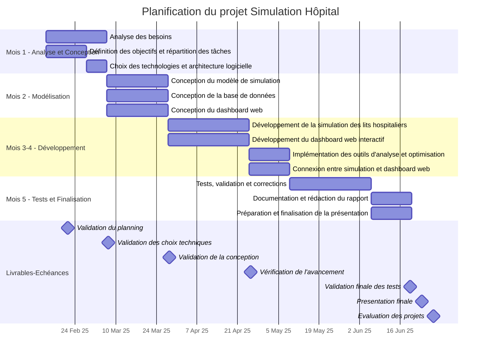

# PLANNING - IA MEDICAL

### Répartition des tâches

| Tâche | Responsable(s) |
|-------------------------------|----------------|
| Analyse des besoins | Tous |
| Définition des objectifs et répartition des tâches | Tous |
| Choix des technologies et architecture logicielle | Lukas & Arsene |
| Conception du modèle de simulation | Carl & Maxence |
| Conception de la base de données | Arsene |
| Conception du dashboard web | Lukas |
| Développement de la simulation des lits hospitaliers | Carl & Maxence |
| Développement du dashboard web interactif | Lukas & Arsene |
| Implémentation des outils d'analyse et optimisation | Tous/TBD |
| Connexion entre simulation et dashboard web | Lukas & Carl |
| Tests, validation et corrections | Tous |
| Documentation et rédaction du rapport | Maxence & Arsene |
| Préparation et finalisation de la présentation | Tous |
| Validation des choix techniques | Tous |
| Validation de la conception | Tous |
| Vérification de l'avancement | Tous |
| Validation finale des tests | Tous |
| Présentation finale | Tous |
| Évaluation des projets | - |

