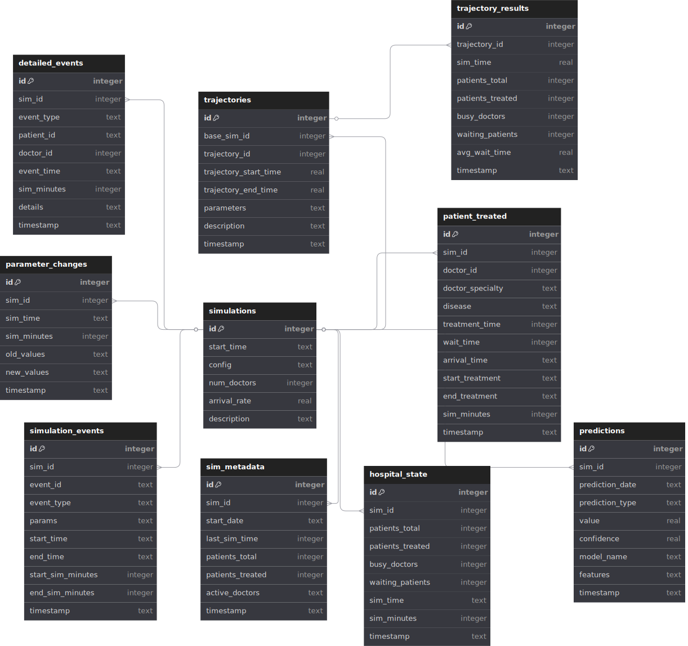

# ia-medical : Système de Simulation Hospitalière & Prédiction IA

> ARTISHOW - Telecom Paris
> Maxence GUINZIEMBA-PROKOP, Arsène MALLET, Carl MONNAERT, Lukas TABOURI

---

> [!CAUTION]
> Le projet est encore en cours de développement.
> Pour suivre l'avancement indicatif de notre projet, voir le [planning](./PLANNING.md)

Un système complet de simulation hospitalière intégrant une simulation par événements discrets, une surveillance en temps réel, des prédictions par apprentissage automatique et des dashboards interactifs.

## Fonctionnalités

### Simulation principale

- **Simulation par événements discrets** : Modélisation réaliste des opérations hospitalières (arrivées, traitements, planification)
- **Multi-spécialités** : Différentes spécialités médicales avec caractéristiques de traitement variées
- **Gestion dynamique des ressources** : Allocation intelligente des médecins et optimisation des flux patients
- **Patrons patients réalistes** : Arrivées dépendantes du temps et événements spéciaux

### Dashboard interactifs

- **Surveillance temps réel** : Statistiques hospitalières en direct avec rafraîchissement automatique
- **Tableau analytique** : Analyse des flux patients, temps d’attente, utilisation des ressources
- **Détection d’incidents** : Identification automatique des problèmes opérationnels
- **Design responsive** : Compatible PC, tablette, mobile

### Prédictions IA - TODO

- **Prédiction de dangers** : Modèles ML pour prédire surcharge, longues attentes, sous-effectif
- **Prévision multi-horizon** : De 1h à 1 semaine à l’avance
- **Évaluation des risques** : Score de danger en temps réel avec indicateurs visuels
- **Analytique prédictive** : Prédiction des volumes futurs et des temps d’attente

### Analyse de données

- **Visualisations interactives** : Graphiques dynamiques (Chart.js)
- **Métriques de performance** : Efficacité des médecins, satisfaction patient, utilisation système
- **Analyse de tendances** : Historique et variations saisonnières

## Architecture du système

```plain
ia-medical/
├── main.py                    # Point d'entrée principal
├── src/
│   ├── simulation/           # Moteur de simulation
│   ├── ml/                  # Modèles de machine learning
│   ├── data/                # Gestion des données et base
│   ├── visualizations/     # Tableau de bord web et UI
│   │   ├── dashboard.py         # Application Flask et routes API
│   │   ├── predictions.py       # Endpoints Flask pour les prédictions IA
│   │   ├── templates/
│   │   │   ├── index.html
│   │   │   ├── analytics.html
│   │   │   ├── incidents.html
│   │   │   ├── realtime.html
│   │   │   └── predictions.html # Page HTML pour les prédictions
│   │   └── static/
│   │       ├── css/
│   │       │   └── dashboard.css
│   │       └── js/
│   │           ├── dashboard.js
│   │           ├── analytics.js
│   │           ├── incidents.js
│   │           ├── realtime.js
│   │           └── predictions.js
│   ├── run_simulation.py   # Lancement simulation
│   ├── run_dashboard.py    # Lancement dashboard
│   ├── run_ml.py           # Opérations ML
│   └── config.py           # Paramètres
├── requirements.txt
└── README.md
```

## Démarrage rapide

### Installation

```bash
# Cloner le dépôt
git clone <repository-url>
cd ia-medical

# Installer les dépendances
pip install -r requirements.txt
```

### Utilisation de base

```bash
# Lancer simulation + dashboard (recommandé)
python main.py --simulation --dashboard --doctors=25 --rate=15

# Ou lancer les composants séparément :
python main.py --simulation --doctors=20 --duration=5
python main.py --dashboard --port=8080
python main.py --ml --train
python main.py --ml --predict --sim-id=1

# Générer la documentation
python main.py --docs
```

### Accès au tableau de bord

Une fois lancé, accédez à l’interface web :

- **Tableau de bord principal** : `http://localhost:8080`
- **Analytique** : `http://localhost:8080/analytics/{sim_id}`
- **Prédictions IA** : `http://localhost:8080/predictions/{sim_id}`
- **Temps réel** : `http://localhost:8080/realtime/{sim_id}`
- **Incidents** : `http://localhost:8080/incidents/{sim_id}`

## Système de prédiction IA

### Types de dangers détectés

1. **Surcharge patient** : Trop de patients par rapport à la capacité
2. **Longues attentes** : Moyenne d’attente > 60 minutes
3. **Sous-effectif** : Utilisation médecins > 90%
4. **Stress système** : Indicateur global de tension

### Horizons temporels

- **Immédiat** (1h) : Risque en temps réel
- **Court terme** (6h) : Planification opérationnelle
- **Moyen terme** (1j) : Planification ressources
- **Long terme** (1 semaine) : Stratégie

### Entraînement des modèles ML

```bash
# Entraîner tous les modèles sur l’historique
python main.py --ml --train

# Entraînement direct
python src/run_ml.py --train

# Lister les simulations
python src/run_ml.py --list
```

### Obtenir des prédictions

```bash
# Prédictions pour une simulation
python main.py --ml --predict --sim-id=1

# Prédiction directe
python src/run_ml.py --predict 1
```

## Pages du dashboard

### Dashboard principal (/)

- Liste des simulations disponibles
- Statistiques et état des simulations
- Navigation rapide
- Sélection de simulation

### Analytique (/analytics/{sim_id})

- **Flux patients** : Suivi du nombre de patients dans le temps
- **Utilisation médecins** : Efficacité et périodes de forte activité
- **Modèles horaires** : Identification des pics
- **Répartition maladies** : Graphiques en secteurs
- **Métriques quotidiennes** : Performances par jour
- **Performance médecins** : Statistiques individuelles

### Incidents (/incidents/{sim_id})

- **Alertes forte attente** : Périodes d’attente excessive
- **Incidents occupation** : Trop de médecins occupés
- **Chronologie événements** : Épidémies, catastrophes, etc.
- **Pires cas patients** : Plus longs temps d’attente
- **Analyse motifs** : Fréquence par heure/type

### Temps réel (/realtime/{sim_id})

- **Contrôles lecture** : Lecture/pause/arrêt, vitesse
- **Métriques en direct** : Patients et médecins actuels
- **Graphiques activité** : Fenêtre glissante 2h
- **Événements récents** : Fil en direct
- **Statut médecins** : Affectations en temps réel
- **Alertes** : Avertissements actifs

### Prédictions (/predictions/{sim_id})

- **Prédictions de dangers** : Surcharge, attente, sous-effectif, etc.
- **Scores de danger** : Scores actuels et futurs (court, moyen, long terme)
- **Explications modèles** : Variables influentes, seuils critiques
- **Historique alertes prédictives** : Périodes anticipées par l’IA
- **Comparaison réel vs prédit** : Graphiques comparatifs

## Configuration

### Paramètres de simulation

```bash
# Simulation de base
python main.py --simulation --doctors=20 --rate=15 --duration=5

# Configuration avancée
python main.py --simulation \
  --doctors=30 \
  --rate=25 \
  --duration=10
```

### Options du dashboard

```bash
# Port et hôte personnalisés
python main.py --dashboard --port=8080 --host=0.0.0.0

# Mode debug
python main.py --dashboard --debug
```

### Paramètres clés (src/config.py)

- `SPECIALTIES` : Spécialités médicales et caractéristiques
- `PATIENT_ARRIVAL_RATE` : Arrivées patients de base
- `TREATMENT_TIME_RANGES` : Durées min/max de traitement
- `DISEASE_PROBABILITIES` : Probabilités des pathologies
- `DANGER_THRESHOLDS` : Seuils de risque ML

## Schéma de base de données

### Tables principales

- **`hospital_state`** : États horodatés de l’hôpital
- **`patient_treated`** : Historique complet des traitements
- **`doctor_activity`** : Logs d’activité des médecins
- **`incidents`** : Incidents détectés et alertes
- **`ml_predictions`** : Prédictions IA et scores de confiance

Un diagramme complet de la base de données :



### Exemples de requêtes

```sql
-- Résumé simulation
SELECT simulation_id, COUNT(*) as patients, 
       AVG(wait_time) as avg_wait
FROM patient_treated 
GROUP BY simulation_id;

-- Périodes à risque
SELECT datetime, patients_waiting, doctors_busy
FROM hospital_state 
WHERE patients_waiting > 20;
```

## API REST

### Endpoints

```bash
# Données simulation
GET /api/simulation/{id}/data

# Prédictions
GET /api/simulation/{id}/predictions

# Entraîner modèles
POST /api/ml/train

# Mises à jour temps réel
GET /api/simulation/{id}/realtime

# Incidents
GET /api/simulation/{id}/incidents
```

### Commandes CLI

```bash
# Opérations simulation
python main.py --simulation [options]
python main.py --dashboard [options]
python main.py --ml [options]

# Accès direct composants
python src/run_simulation.py [options]
python src/run_dashboard.py [options]
python src/run_ml.py [options]
```

## Dépendances

### Dépendances principales

- **Python 3.8+**
- **Flask 2.3+** - Framework web
- **NumPy 1.24+** - Calcul numérique
- **Pandas 1.5+** - Manipulation de données
- **SimPy 4.0+** - Simulation événements discrets

### Dépendances ML

- **scikit-learn 1.3+** - Machine learning
- **joblib 1.1+** - Sauvegarde modèles
- **matplotlib 3.7+** - Graphiques
- **seaborn 0.12+** - Visualisation statistique

### Frontend

- **Chart.js 4.0+** - Graphiques interactifs (CDN)
- **Bootstrap 5.1+** - UI (CDN)
- **Font Awesome 6.0+** - Icônes (CDN)

## Poster de présentation 


## Licence

Le projet est sous license MIT, plus d'informations [ici](./LICENSE).

